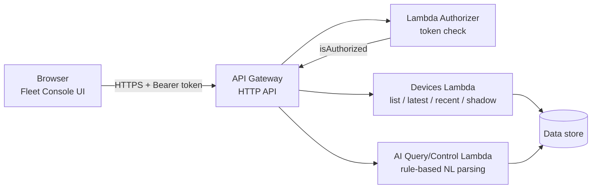

# Fleet Console

A lightweight IoT device management dashboard for a serverless AWS backend. Monitor live telemetry across a mixed fleet of devices, inspect history and trends, control device state via device shadows, and query or command devices using natural language.


## What it does

- **Device list** — all connected devices, auto-grouped by type (Home, Industrial, Outdoor, Security, Sensors), with live status indicators.
- **Latest telemetry** — current readings for any selected device (temperature, humidity, power draw, status, etc.), rendered as metric cards.
- **History & trends** — recent readings table plus an auto-generated trend line for numeric fields (e.g. temperature over time).
- **Device shadow control** — view current desired/reported state and update it (quick power on/off, or raw JSON for advanced control).
- **AI console** — a natural-language interface wired to the backend's `/ai/query` (ask about a device) and `/ai/control` (command a device) endpoints, with a mode toggle.

No build step. No framework. Open the HTML file, point it at your API, and it runs.

## Architecture



**Auth model:** every route sits behind a Lambda authorizer (HTTP API, payload format 2.0, Simple response mode) that checks a static bearer token in the `Authorization` header. This is intentionally simple for a prototype — see [Known limitations](#known-limitations) for what a production version should change.

## Endpoints used

| Method | Route                         | Purpose                                                                               |
| ------ | ----------------------------- | ------------------------------------------------------------------------------------- |
| GET    | `/devices`                    | List all devices                                                                      |
| GET    | `/devices/{deviceId}/latest`  | Latest telemetry for a device                                                         |
| GET    | `/devices/{deviceId}/recent`  | Recent telemetry history                                                              |
| GET    | `/devices/{deviceId}/shadow`  | Current device shadow (desired/reported state)                                        |
| POST   | `/devices/{deviceId}/shadow`  | Update device shadow                                                                  |
| POST   | `/ai/query`                   | Ask a natural-language question about a device                                        |
| POST   | `/ai/control`                 | Issue a natural-language command to a device                                          |
| POST   | `/devices/{deviceId}/summary` | AI-generated summary _(currently erroring server-side, see below)_                    |
| POST   | `/devices/{deviceId}/video`   | HLS video stream URL for camera devices _(currently erroring server-side, see below)_ |

## Running it locally

The dashboard is a single static HTML file (`fleet-console.html`) — but it must be served over `http://`, not opened directly as a `file://` path, or the browser will block API requests regardless of CORS configuration.

**Option A — VS Code Live Server**

1. Install the **Live Server** extension (publisher: Ritwick Dey).
2. Right-click `fleet-console.html` → **Open with Live Server**.
3. It opens at `http://127.0.0.1:5500/fleet-console.html`.

**Option B — Python's built-in server**

```bash
cd path/to/repo
python -m http.server 5500
```

Then visit `http://localhost:5500/fleet-console.html`.

Once open, enter your API base URL and Authorization token in the top bar and click **Connect**.

## Deploying the backend

The Lambda functions and API Gateway configuration live in `/backend`. This repo documents the setup; redeploying requires:

1. An API Gateway **HTTP API** with routes matching the table above.
2. A Lambda authorizer (payload format 2.0, Simple response mode) attached to all routes.
3. CORS enabled on the API (`Access-Control-Allow-Origin`, `Access-Control-Allow-Headers: content-type, authorization`, methods `GET, POST, OPTIONS`).
4. Environment-specific secrets (auth token, any downstream service credentials) — **do not commit these**; see `.gitignore`.

## Known limitations

- `/devices/{deviceId}/summary` currently fails with `ResourceNotFoundException` on the underlying model invocation — likely a misconfigured or unavailable model resource. Not yet fixed.
- `/devices/{deviceId}/video` currently fails with `AccessDeniedException` on the HLS streaming call — likely an IAM permissions gap on the Lambda's execution role. Not yet fixed.
- Auth is a single static bearer token checked in a Lambda authorizer. Fine for a prototype; a production version should move to something like Cognito, JWT, or API keys with per-client scoping.
- The AI query/control endpoints use rule-based intent parsing (`parsed_by: rule_engine`), not a full LLM — natural language coverage is limited to the phrasings the rule engine recognizes.

## Screenshots

_(add screenshots of the dashboard here — see "Adding screenshots" below)_


## License

MIT — see `LICENSE`.
